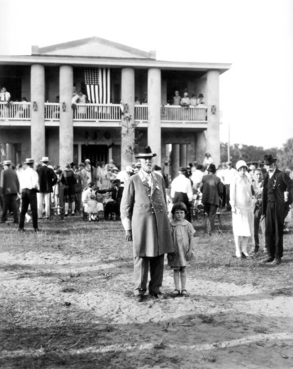
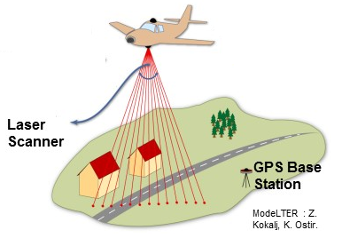
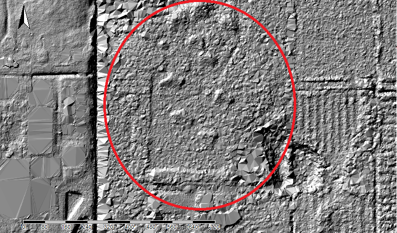
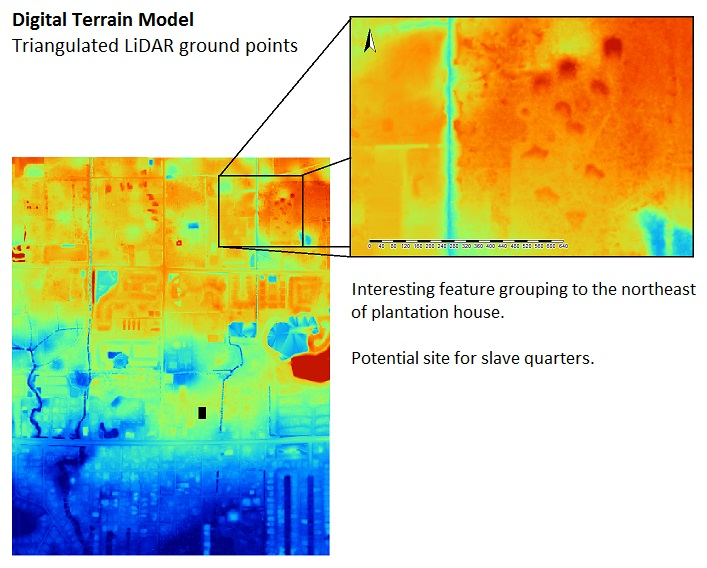
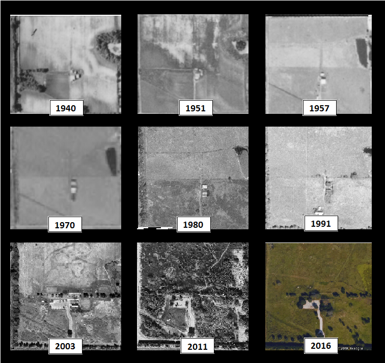

Major Robert Gamble founded Gamble Plantation on 160 acres along the Manatee River in the mid-1840s. By 1850 his holdings expanded to include 3,500 acres and over 200 enslaved workers. Today, a portion of what was once the plantation is now part of a [State Park](https://www.floridastateparks.org/park/Gamble-Plantation). 

[Gamble Plantation Map](Gamble_Plantation/Map.HTML)



The Park consists of the antebellum plantation house, a small museum, and a few small related features. Noticeably absent from the property, however, are the quarters where the enslaved Africans working the planation would have lived. 

These enslaved African domestic sites have yet to be located and uncovered by archaeologists or historians. This is unfortunate, because a lack of archaeological information about the daily lives of the enslaved at Gamble has led to a skewed perception of history that ignores the cultural heritage of African Americans.


### Research Goals

Currently, no know historical documents exist explicitly stating where the living quarters of those enslaved at Gamble Plantation were located. Based on similar plantations in Florida, we believe the quarters would have been in the general vicinity of the plantation house. 

In archaeological investigations, it is customary to perform a ground survey on foot to assess if an area would be ideal to dig in. However, because the area we are interested in is both expansive and largely developed, ground survey would not be an effective way to identify potential excavation sites. 

Therefore, we hypothesize that we will be able to use LiDAR data to identify potential areas of slave domestic sites. Once these areas are identified, archaeological investigation can be conducted to either confirm or deny the presence of slave quarters. 


### What is LiDAR?!

Light Detection and Ranging (LiDAR) is a system of remote sensing. A place with a LiDAR sensor flies over an area and uses a laser to discharge light towards the ground. This light bounces off of things like trees and buildings before it is reflected back to the LiDAR sensor and is recorded. The sensor also communicates with satellites to assign a GPS location for each data set.

Based on the time it takes for the light to reflect back to the sensor, we are able to understand what kinds of structures or vegetation are present, and determine the elevation of an area.




### Why is LiDAR important to archaeologists?

LiDAR is increasingly important in archaeology because it allows archaeologists to visualize areas that are inaccessible. 

It’s also helpful because it allows us to see features that might not be visible with the naked eye.


### What We’ve Found So Far






We also looked at aerial photographs over the past several decades to look at the progression of land use in the area.



### About The Authors


Matt Litteral and Kate Padula are Master's Candidates in Applied Anthropology at the University of South Florida. They are both archaeologists studying sugar plantations in Florida.

### Contact Us


You can use the [editor on GitHub](https://github.com/KPadula/Gamble_Plantation/edit/master/README.md) to maintain and preview the content for your website in Markdown files.

Whenever you commit to this repository, GitHub Pages will run [Jekyll](https://jekyllrb.com/) to rebuild the pages in your site, from the content in your Markdown files.

### Markdown

Markdown is a lightweight and easy-to-use syntax for styling your writing. It includes conventions for

```markdown
Syntax highlighted code block

# Header 1
## Header 2
### Header 3

- Bulleted
- List

1. Numbered
2. List

**Bold** and _Italic_ and `Code` text

[Link](url) and 
```

For more details see [GitHub Flavored Markdown](https://guides.github.com/features/mastering-markdown/).

### Jekyll Themes

Your Pages site will use the layout and styles from the Jekyll theme you have selected in your [repository settings](https://github.com/KPadula/Gamble_Plantation/settings). The name of this theme is saved in the Jekyll `_config.yml` configuration file.

### Support or Contact

Having trouble with Pages? Check out our [documentation](https://help.github.com/categories/github-pages-basics/) or [contact support](https://github.com/contact) and we’ll help you sort it out.
