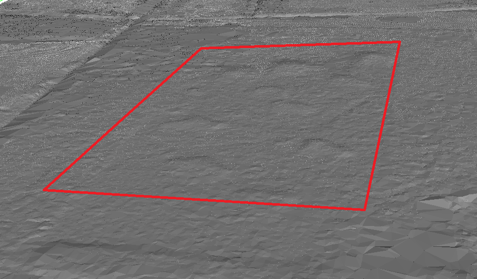
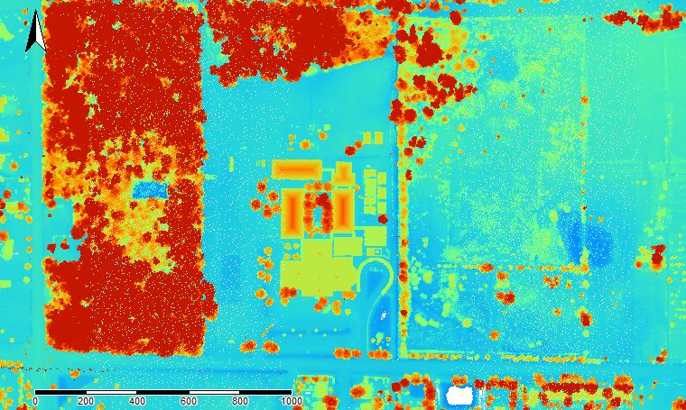

Major Robert Gamble founded Gamble Plantation on 160 acres along the Manatee River in the mid-1840s. By 1850 his holdings expanded to include 3,500 acres and over 200 enslaved workers. Today, a portion of what was once the plantation is now part of a [State Park](https://www.floridastateparks.org/park/Gamble-Plantation). 

[Gamble Plantation Map](Gamble_Plantation/Map.HTML)

The Park consists of the antebellum plantation house, a small museum, and a few small related features. Noticeably absent from the property, however, are the quarters where the enslaved Africans working the planation would have lived. 

These enslaved African domestic sites have yet to be located and uncovered by archaeologists or historians. This is unfortunate, because a lack of archaeological information about the daily lives of the enslaved at Gamble has led to a skewed perception of history that ignores the cultural heritage of African Americans.

### Research Goals

Currently, no know historical documents exist explicitly stating where the living quarters of those enslaved at Gamble Plantation were located. Based on similar plantations in Florida, we believe the quarters would have been in the general vicinity of the plantation house. 

In archaeological investigations, it is customary to perform a ground survey on foot to assess if an area would be ideal to dig in. However, because the area we are interested in is both expansive and largely developed, ground survey would not be an effective way to identify potential excavation sites. 

Therefore, we hypothesize that we will be able to use LiDAR data to identify potential areas of slave domestic sites. Once these areas are identified, archaeological investigation can be conducted to either confirm or deny the presence of slave quarters. 

### What is LiDAR?!

Light Detection and Ranging (LiDAR) is a system of remote sensing. A place with a LiDAR sensor flies over an area and uses a laser to discharge light towards the ground. This light bounces off of things like trees and buildings before it is reflected back to the LiDAR sensor and is recorded. The sensor also communicates with satellites to assign a GPS location for each data set.

Based on the time it takes for the light to reflect back to the sensor, we are able to understand what kinds of structures or vegetation are present, and determine the elevation of an area.

### Why is LiDAR important to archaeologists?

LiDAR is increasingly important in archaeology because it allows archaeologists to visualize areas that are inaccessible. 

It’s also helpful because it allows us to see features that might not be visible with the naked eye.

### What We’ve Found So Far

The small raised features seen in the above photo could possibly be the remains of collapsed slave quarters. To get a better view of elevation on these potential features, we made a profile of the ground points.

To make sure there weren’t any classification errors, in which vegetation (like trees) could be confused with ground points, we created a visualization of all points (including trees).

To confirm that these are archaeological features, and not naturally occurring (i.e. trees), or modern structures, we need to use additional visualizations.

This visualization is a hillshade of the bare earth points in our area of interest. What this means is 

This type of visualization shows an area as if the sun was shining from  XXXXXXXXXXXXXXXXXX

We also wanted to see if there were any modern structures previously in the area that could have left behind or made these features. To do this, we looked at historic aerial photos of the area (mention FDOT) for the past 75 years. We were also able to identify the features in almost all of the historic aerial photos.

Since these features are visible as far back as 1951, and since these photos show there have been no structures in this area since 1940, the features must have been created prior to 1940, and are good candidates for being potential slave quarters.  
 
### What Finding the Slave Quarters Would Mean
Using these LiDAR visualizations to confirm an area where the slave quarters might be located can tell us about the settlement patterns of the enslaved. It can also open up the door to archaeological excavation, which in turn can help us understand the daily lives of the enslaved, community organization, etc. 

Additionally, since the museum at Gamble Plantation Historic State Park currently does not include a heavy narrative about the enslaved, slave quarter excavations could supply key information that would lead to  African-American heritage finally being represented at the museum. 

### Is Your Home a Piece of Gamble History?! 
Do you live in the area around Gamble Plantation?
Have you ever found artifacts or old foundations on your property?
Does your land have a unique history?

If you answered **yes** to any of these questions, we want to hear from you! Send us an email at address listed below - we'd love to learn about your property and potentially schedule a walkthrough of your land. 

### About The Authors

**Matt Litteral** and **Kate Padula** are Master's Candidates in Applied Anthropology at the University of South Florida. They are both in the archaeology track, studying sugar plantations in Florida.

### Contact Us

If you are interested in learning more about this project, or have any information you think would help in our research, please contact Matt Litteral at mattlitteral@mail.usf.edu.
